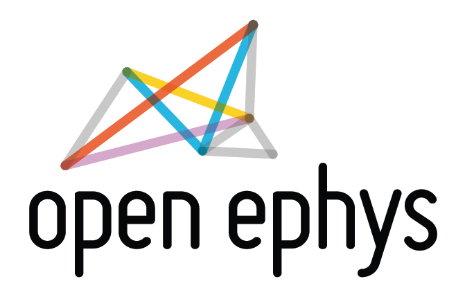

# Open Ephys GUI

## Sustainability Roadmap between DataJoint Elements and Open Ephys GUI

<figure markdown>
  {: style="height:50px; padding-right:25px"}
  {: style="height:87px"}
</figure>

## Aim

**DataJoint Elements** and **Open Ephys GUI** are two neuroinformatics initiatives in active development. The projects develop independently yet they have complementary aims and overlapping user communities. This document establishes key processes for coordinating development and communications in order to promote integration and interoperability across the two ecosystems.

## Projects and Teams

### DataJoint

**DataJoint Elements** — https://datajoint.com/docs/elements/ — is a collection of open-source reference database schemas and analysis workflows for neurophysiology experiments, supported by **DataJoint Core** — https://datajoint.com/docs/core/ — an open-source software framework. The project is funded by the NIH grant U24 NS116470 and led by Dr. Dimitri Yatsenko.

The principal developer of DataJoint Elements and DataJoint Core is the company
DataJoint — https://datajoint.com.
  
### Open Ephys GUI

**Open Ephys GUI** — https://open-ephys.org/gui — is an open-source, plugin-based application for processing, visualizing, and recording data from extracellular electrodes. The project is funded by the NIH grant U24 NS109043 and led by Dr. Josh Siegle.

The principal developers of the Open Ephys GUI are at the Allen Institute.

## General Principles

### No obligation

The developers of the two ecosystems acknowledge that this roadmap document creates no contractual relationship between them but they agree to work together in the spirit of partnership to ensure that there is a united, visible, and responsive leadership and to demonstrate administrative and managerial commitment to coordinate development and communications.

### Coordinated Development

The two projects will coordinate their development approaches to ensure maximum interoperability. This includes:

- coordinated use of terminology and nomenclatures
- support for testing infrastructure
- a coordinated software release process and versioning
- coordinated resolution of issues arising from joint use of the two tools

### Points of Contact

To achieve the aims of coordinated development, both projects appoint a primary point of
contact (POC) to respond to questions relating to the integration and interoperability 
of DataJoint Elements and Open Ephys GUI.

For 2023, the DataJoint Elements POC is Dr. Thinh Nguyen (thinh@datajoint.com).

For 2023, the Open Ephys GUI POC is Dr. Josh Siegle (joshs@alleninstitute.org).

### Annual Review

To achieve the aims of coordinated development, the principal developers conduct a joint
annual review of this roadmap document to ensure that the two programs are well integrated and not redundant. The contents and resolutions of the review will be made publicly available.

### Licensing

The two parties ensure that relevant software components are developed under licenses
that avoid any hindrance to integration and interoperability between DataJoint Elements
and Open Ephys GUI.

## Development Roadmap

- [x] Mechanism to import data acquired with the Open Ephys GUI - Completed 2021 - [DataJoint Element Array Ephys - Open Ephys module](https://github.com/datajoint/element-array-ephys/blob/main/element_array_ephys/readers/openephys.py)

- [x] Integration tests to verify loading of Open Ephys data - Completed 2021 - [Pytests](https://github.com/datajoint/workflow-array-ephys/blob/main/tests/test_populate.py)

- [x] The Open Ephys team will inform the DataJoint team about any software releases that include changes to the binary data format (ongoing).

## Citation

If you use this package, please cite the [Open Ephys paper](https://iopscience.iop.org/article/10.1088/1741-2552/aa5eea/meta) in your publications.
