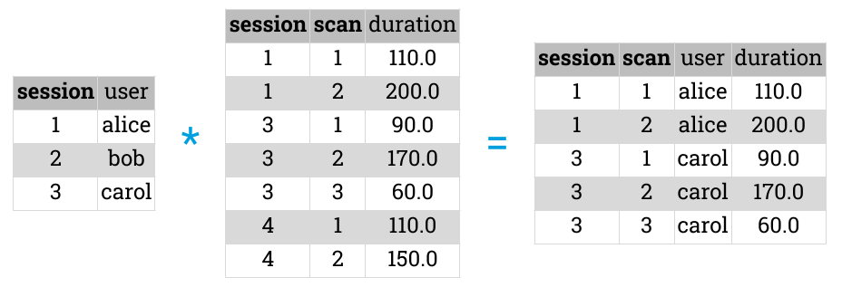
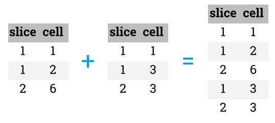

# Operators

[Data queries](./query-objs) make use of operators to derive the desired table. They
represent the desired data symbolically, but do not contain any data. Once a query is
formed, we can [fetch](./common-commands#fetch) the data into the local workspace. Since
the expressions are only symbolic, repeated `fetch` calls may yield different results as
the state of the database is modified.

DataJoint implements a complete algebra of operators on tables:

| operator                     | notation       | meaning                                                                 |
|------------------------------|----------------|-------------------------------------------------------------------------|
| [join](#join)                | A * B          | All matching information from A and B                                   |
| [restriction](#restriction)  | A & cond       | The subset of entities from A that meet the condition                   |
| [restriction](#restriction)  | A - cond       | The subset of entities from A that do not meet the condition            |
| [proj](#proj)                | A.proj(...)    | Selects and renames attributes from A or computes new attributes        |
| [aggr](#aggr)                | A.aggr(B, ...) | Same as projection with computations based on matching information in B |
| [union](#union)              | A + B          | All unique entities from both A and B                                   |
| [universal set](#universal-set)\*| dj.U()     | All unique entities from both A and B                                   |

\*While not technically a query operator, it is useful to discuss Universal Set in the 
same context.

??? note "Notes on relational algebra" 

    DataJoint's algebra improves upon the classical
    relational algebra and upon other query languages to simplify and enhance the
    construction and interpretation of precise and efficient data queries.

    1.  **Entity integrity**: Data are represented and manipulated in the form of tables
    representing well-formed entity sets. This applies to the inputs and outputs of
    query operators. The output of a query operator is an entity set with a
    well-defined entity type, a primary key, unique attribute names, etc.

    2.  **Algebraic closure**: All operators operate on entity sets and yield entity
    sets. Thus query expressions may be used as operands in other expressions or may be
    assigned to variables to be used in other expressions.

    3.  **Attributes are identified by names**: All attributes have explicit names. This
    includes results of queries. Operators use attribute names to determine how to
    perform the operation. The order of the attributes is not significant.

These operators are based on the concept of **matching entities**. Two
entities **match** when they have no shared fields, or when their shared fields contain
the same values. Any shared fields should have compatible datatypes to allow equality
comparisons. Matching entities can be **merged** into a single entity without any
conflicts of attribute names and values.

In order for these operators to be applied to tables, they must also be 
**join-compatible**, which means that:

1.  All fields in both tables must be part of either the 
[primary key](../../../glossary#primary-key) or a [foreign key](../../../glossary#foreign-key).

2.  All common fields must be of a compatible datatype for equality comparisons.

??? note "Why join compatibility restrictions?" 

    These restrictions are introduced both for performance reasons and for conceptual
    reasons. For performance, they encourage queries that rely on indexes. For
    conceptual reasons, they encourage database design in which entities in different
    tables are related to each other by the use of primary keys and foreign keys.

## Join

The Join operator `A * B` combines the matching information in `A` and `B`. The result
contains all matching combinations of entities from both arguments, including all
unique [primary keys](../../../glossary#primary-key) from both arguments. 

In the example below, we look at the union of (A) a table pairing sessions with users
and (B) a table pairing sessions with scan. 

<figure markdown>
{: style="height:200px"}
</figure>

This has all the primary keys of both tables (a union thereof, shown in bold) as well as
all [secondary attributes](../../../glossary#seconday-attribute) (i.e., user and
duration). This also excludes the session for which we don't have a scan.

We can also join based on secondary attributes, as shown in the example below.

<figure markdown>
{: style="height:200px"}
</figure>

??? notes "Additional join properties" 

    When the operands have no common attributes, the result is the cross product --
    all combinations of entities. In all cases, however ...

    1.  When `A` and `B` have the same attributes, the join `A * B` becomes equivalent to
    the set intersection `A` ∩ `B`. Hence, DataJoint does not need a separate intersection
    operator.
    2.  Commutativity: `A * B` is equivalent to `B * A`.
    3.  Associativity: `(A * B) * C` is equivalent to `A * (B * C)`.

## Restriction

The restriction operator `A & cond` selects the subset of entities from `A` that meet
the condition `cond`. The exclusion operator `A - cond` selects the complement of
restriction, i.e. the subset of entities from `A` that do not meet the condition
`cond`. This means that the restriction and exclusion operators are complementary.
The same query could be constructed using either `A & cond` or `A - Not(cond)`.

<figure markdown>
{: style="height:200px"}
</figure>

The condition `cond` may be one of the following:

=== "Python"

    -   another table
    -   a mapping, e.g. `dict`
    -   an expression in a character string
    -   a collection of conditions as a `list`, `tuple`, or Pandas `DataFrame`
    -   a Boolean expression (`True` or `False`)
    -   an `AndList`
    -   a `Not` object
    -   a query expression

=== "Matlab"

    -   another table
    -   a mapping, or `struct`
    -   an expression in a character string
    -   a collection of conditions as a `struct` or cell array
    -   a Boolean expression (`true` or `false`)
    -   a query expression

For more examples on each of these in Python and Matlab, please visit the documentation
for the respective API.

??? Warning "Permissive Operators"

    To circumvent compatibility checks, DataJoint offers permissive operators for 
    Restriction (`^`) and Join (`@`). Use with Caution.

## Proj

The `proj` operator represents **projection** and is used to select attributes
(columns) from a table, to rename them, or to create new calculated attributes.

1. A simple projection *selects a subset of attributes* of the original
table, which may not include the [primary key](../../../glossary#primary-key).

2. A more complex projection *renames an attribute* in another table. This could be
useful when one table should be referenced multiple times in another. A user table,
could contain all personnel. A project table references one person for the lead and
another the coordinator, both referencing the common personnel pool.

3. Projection can also perform calculations (as available in 
[MySQL](https://dev.mysql.com/doc/refman/5.7/en/functions.html)) on a single attribute.

For examples of each of these in Python and Matlab, please visit the documentation for
the respective API.

## Aggr

**Aggregation** is a special form of `proj` with the added feature of allowing
  aggregation calculations on another table. It has the form `table.aggr
  (other, ...)` where `other` is another table. Aggregation allows adding calculated
  attributes to each entity in `table` based on aggregation functions over attributes
  in the matching entities of `other`.

Aggregation functions include `count`, `sum`, `min`, `max`, `avg`, `std`, `variance`,
and others. For examples in Python and Matlab, please visit the documentation for the
respective API.

## Union

The result of the union operator `A + B` contains all the entities from both operands. 

[Entity normalization](./normalization) requires that `A` and `B` are of the same type,
with with the same [primary key](../../../glossary#primary-key), using homologous
attributes. Without secondary attributes, the result is the simple set union. With
secondary attributes, they must have the same names and datatypes. The two operands
must also be **disjoint**, without any duplicate primary key values across both inputs.
These requirements prevent ambiguity of attribute values and preserve entity identity.

??? Note "Principles of union"

    1.  As in all operators, the order of the attributes in the operands is not
    significant.

    2.  Operands `A` and `B` must have the same primary key attributes. Otherwise, an
    error will be raised.

    3.  Operands `A` and `B` may not have any common non-key attributes. Otherwise, an
    error will be raised.

    4.  The result `A + B` will have the same primary key as `A` and `B`.

    5.  The result `A + B` will have all the non-key attributes from both `A` and `B`.

    6.  For entities that are found in both `A` and `B` (based on the primary key), the
    secondary attributes will be filled from the corresponding entities in `A` and
    `B`.

    7.  For entities that are only found in either `A` or `B`, the other operand's
    secondary attributes will filled with null values.

For union, order does not matter.

<figure markdown>
{: style="height:200px"}
</figure>
<figure markdown>
{: style="height:200px"}
</figure>

??? Note "Properties of union"

    1.  Commutative: `A + B` is equivalent to `B + A`.
    2.  Associative: `(A + B) + C` is equivalent to `A + (B + C)`.

## Universal Set

All of the above operators are designed to preserve their input type. Some queries may
require creating a new entity type not already represented by existing tables. This
means that the new type must be defined as part of the query. Universal sets fulfill
this role using `dj.U` notation. They denote the set of all possible entities with
given attributes of any possible datatype. Attributes of universal sets are allowed to
be matched to any namesake attributes, even those that do not come from the same
initial source.

For examples in Python and Matlab, please visit the documentation for the respective
API.
